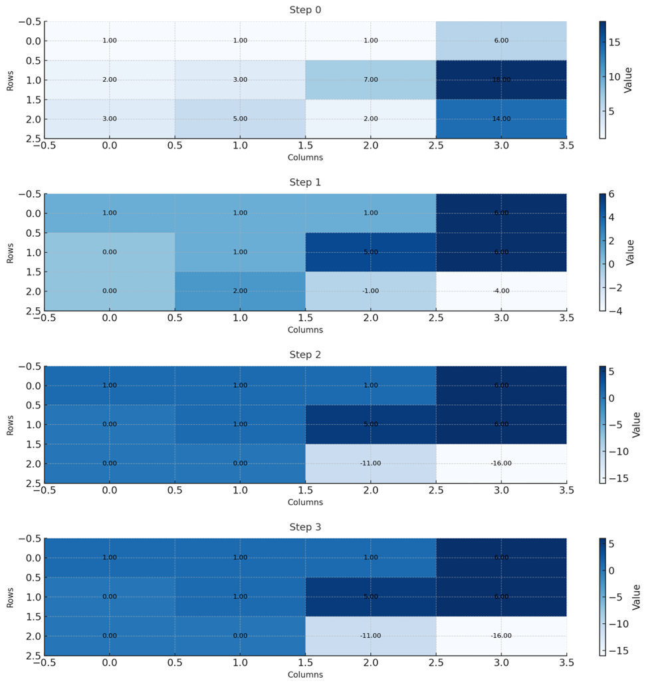
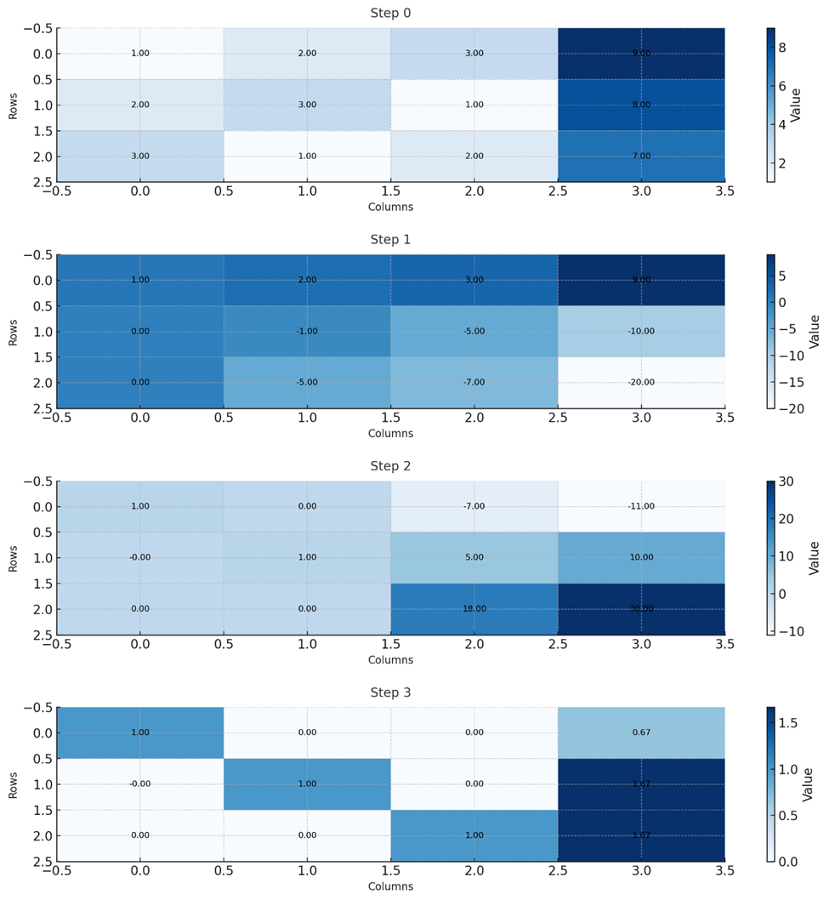
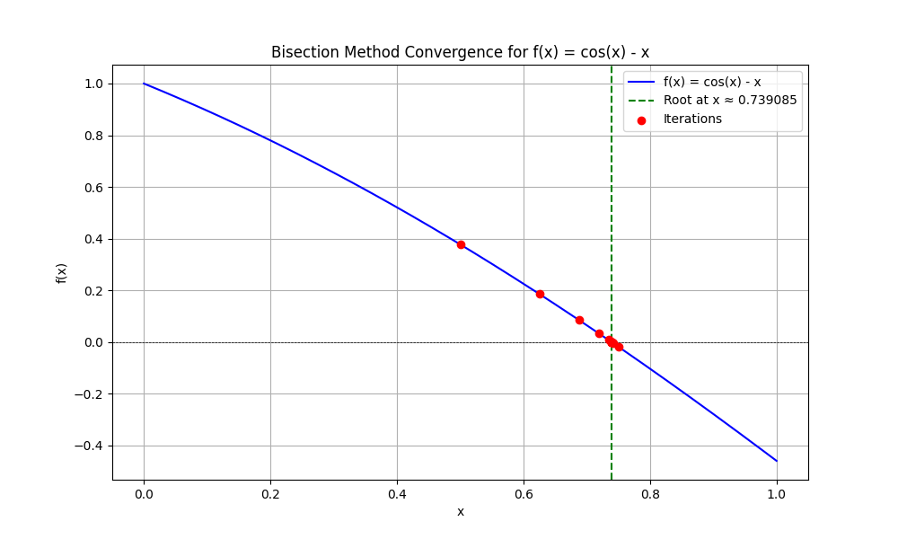
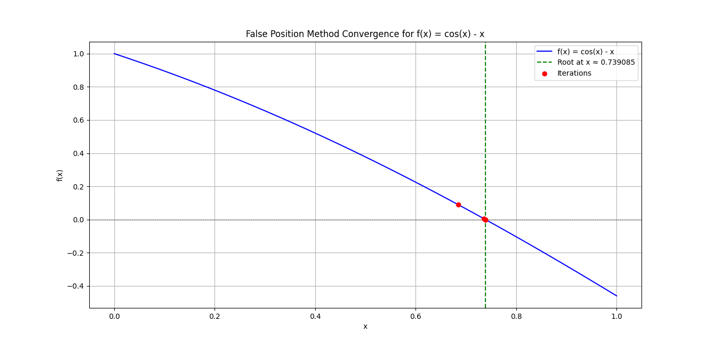
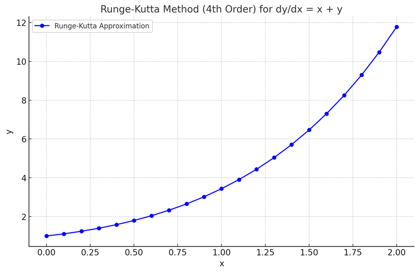
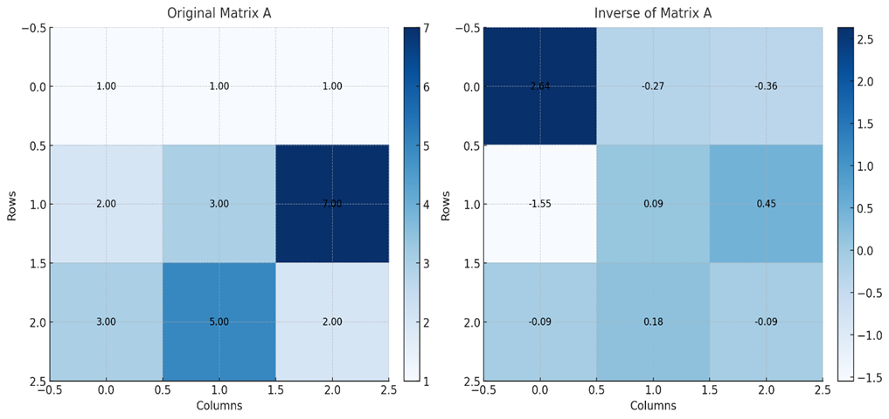

# 
Hello, Visitor!

This is a console application, a project which implements various numerical methods to solve mathematical problems.

## Implemented Numerical Methods
1. **Solution of Linear Equations**
    * [Jacobi iterative method](README.md#jacobi-iterative-method)
    * [Gauss-Seidel iterative method](README.md#gauss-seidel-iterative-method)
    * [Gauss elimination](README.md#gauss-elimination)
    * [Gauss-Jordan elimination](README.md#gauss-jordan-elimination)
    * [LU factorization](README.md#lu-factorization)
2. **Solution of Non-linear Equations**
    * [Bi-section method](README.md#bi-section-method)
    * [False position method](README.md#false-position-method)
    * [Secant method](README.md#secant-method)
    * [Newton-Raphson method](README.md#newton-raphson-method)
3. **Solution of Differential Equations**
    * [Runge-Kutta method](README.md#runge-kutta-method)
4. **[Matrix Inversion](README.md#matrix-inversion)**

## Jacobi Iterative Method

## Gauss-Seidel Iterative Method

## Gauss Elimination
# Gauss Elimination

**Purpose**: The Gauss Elimination method is a systematic procedure to solve a system of linear equations. It converts the matrix into an upper triangular form, from which you can use back-substitution to find the solution.

## How It Works

### 1. Forward Elimination:
- Convert the coefficient matrix to an upper triangular form by performing row operations.
- The goal is to have all zeros below the main diagonal of the matrix.
- To achieve this, use the following operations:
  - Subtract a multiple of one row from another to make the elements below the pivot (diagonal) equal to zero.

### 2. Back Substitution:
- Once the matrix is in upper triangular form, start from the last row and work your way up to solve for each variable.
- Use previously computed variable values to solve the current equation.

## Example

## Given System of Equations

    x + y + z = 6 
    2x + 3y + 7z = 18 
    3x + 5y + 2z = 14

## Convert to Augmented Matrix Form
     ____     ____
    |             |
    | 1  1  1 |6  |
    | 2  3  7 |18 |
    | 3  5  2 |14 |
    |___       ___|

- Perform row operations to make it upper triangular.
- Use back-substitution to find the values of \(x\), \(y\), and \(z\).

# Forward Elimination
1. For each column `i` in A:
    * Find pivot element in row i
    * For each row j below the pivot row:
        * `Factor = A[j][i] / A[i][i]`
        * For each column k in row j:
            * `A[j][k] = A[j][k] - Factor * A[i][k]`
        * `b[j] = b[j] - Factor * b[i]`

# Back Substitution
2. For row `i` from last to first:
    * `x[i] = (b[i] - sum(A[i][j] * x[j] for j from i+1 to end)) / A[i][i]` 

# The Visual Representation of the Matrix is:

## Gauss-Jordan Elimination
`Purpose`: Gauss-Jordan Elimination is an extension of Gauss Elimination. It simplifies the system further to the Reduced Row Echelon Form (RREF), from which the solution can be read directly without back-substitution.
# How It Works
1.	`Forward Elimination`:
    - Similar to Gauss Elimination, perform row operations to make the elements below the main diagonal zero.
2.	`Backward Elimination`:
    -	Normalize the pivot elements to 1 by dividing the entire row by the pivot value.
    -	Use the pivot rows to make all entries above and below each pivot equal to zero.
    - 	The solutions x, y, and z can be directly read from the matrix.
3.	The resulting matrix will be in Reduced Row Echelon Form, which looks like:
##
     ____     ____
    |             |
    | 1  0  0 |x  |
    | 0  1  0 |y  |
    | 0  0  1 |z  |
    |___       ___|

# Example
From the above augmented matrix:
1.	Use additional row operations to make elements above the diagonal zero.
2.	Normalize the diagonal elements to 1.
3.	Directly extract the solutions from the final matrix.

# Pseudocode:
1. For each column i in A:
    -   Normalize row i by dividing by the pivot A[i][i]
    - For each row j (j != i):
        - Factor = A[j][i]
        - For each column k in row j:
            - A[j][k] = A[j][k] - Factor * A[i][k]
        - b[j] = b[j] - Factor * b[i]

# The Visual Representation of the Matrix is:

## LU Factorization
LU Factorization is a fundamental technique in linear algebra used to solve systems of linear equations. It expresses a given square matrix A as a product of two matrices, one lower `L` and one upper `U` i.e. `A = LU`. This simplifies many matrix operations, making it an essential tool in various engineering applications.

### How it works
1. Given a set of linear equations of the form  
    &nbsp;&nbsp;&nbsp;&nbsp;&nbsp;<code>a11x1 + a12x2 + a13x3 + ... + a1nxn = b</code>  
    &nbsp;&nbsp;&nbsp;&nbsp;&nbsp;<code>a21x1 + a22x2 + a23x3 + ... + a2nxn = b</code>  
    &nbsp;&nbsp;&nbsp;&nbsp;&nbsp;<code>a31x1 + a32x2 + a33x3 + ... + a3nxn = b</code>  
    &nbsp;&nbsp;&nbsp;&nbsp;&nbsp;<code>.....................................</code>  
    &nbsp;&nbsp;&nbsp;&nbsp;&nbsp;<code>an1x1 + an2x2 + an3x3 + ... + annxn = b</code>  
convert them into matrix form `AX = B` where `A` is the coefficient matrix,`X` is variable matrix and `B` is the matrix of constants on the right side of the equation.
2. Create two matrices naming `L` and `U` of the same size as `A`. Calculate the values of the elements of both matrices such that `LU = A`
3. Now equation can be written as `LUX = B` or `LY = B` where `UX = Y`
4. Solve `Y` from `LY = B` and then using `Y` solve `X` from `UX = Y`
<!--  -->

## Bi-section Method
Bi-section method is used to find root of an equation in a given interval i.e. value of `x` for which `f(x) = 0`.  
The method is based on *The Intermediate Value Theorem* which states that if `f(x)` is a continuous function and there are two real numbers `a` and `b` such that `f(a)*f(b) < 0`, then it is guaranteed that it has at least one root between them.
### How it works
#### Assumptions
1. `f(x)` is a continuous function in interval `[a, b]`
2. `f(a) * f(b) < 0`
#### Steps
1. Find middle point `c = (a + b)/2` .
2. `If` `f(c) == 0`, then `c` is the root of the solution.
3. `Else` `f(c) != 0`
    1. `If` value `f(a)*f(c) < 0` then root lies between `a` and `c`. So we recur for `a` and `c`
    2. `Else If` `f(b)*f(c) < 0` then root lies between `b` and `c`. So we recur `b` and `c`.
    3. `Else` given function doesn’t follow one of assumptions.
4. Repeat the steps until difference between `a` and `b` is less then a value (very small value).
# The Visual Representation For Bisection Method :

## False Position Method
Like Bi-section method, False Position method is also an approximation method to find the roots of a given equation by repeatedly dividing the interval.  
False position method is the same as Bi-section method with the only difference is that instead of finding the middle point we find the point that touches the x-axis.
### Steps
1. Find middle point `c = (a*func(b)-b*func(a))/(func(b)-func(a))` .
2. `If` `f(c) == 0`, then `c` is the root of the solution.
3. `Else` `f(c) != 0`
    1. `If` value `f(a)*f(c) < 0` then root lies between `a` and `c`. So we recur for `a` and `c`
    2. `Else If` `f(b)*f(c) < 0` then root lies between `b` and `c`. So we recur `b` and `c`.
    3. `Else` given function doesn’t follow one of assumptions.
4. Repeat the steps until difference between `a` and `b` is less then a value (very small value).

# The Visual Representation For False Position  Method :
      

## Secant Method

## Newton-Raphson Method

## Runge-Kutta Method
`Purpose`: The Runge-Kutta method is a numerical technique used to solve ordinary differential equations (ODEs) of the form:
- dy/dx=f(x,y)

This method estimates the value of y at a given x using an iterative approach.
# How It Works
The 4th-Order Runge-Kutta Method is the most commonly used variant due to its balance of accuracy and computational efficiency. Here’s how it works:

	1. `Initialize`:
	    -> Start with the initial condition: x0, y0.
	    -> Define the step size hand the endpoint x_end.
	
    2. Iterative Steps:

	-> Compute four slopes (k-values) for each step:
	-> k1 = h*f(x,y)
	-> k2 = h*f( x + 0.5h, y + 0.5k1)
	-> k3 = h*f(x + 0.5h,y + 0.5k2)
	-> k4 = h*f(x + h,y + k3)
	
    3. Update the next value:
    
    -> y_next = y + 1/6(k1 + 2k2 + 2k3 + k4)
	-> Increment x by h.
	-> Repeat until the target x_end is reached.

# Example
Given:

dy/dx = x + y, x0 = 0,  y0 = 1,x_end = 2, h = 0.1 

The program calculates intermediate values using the 4th-order Runge-Kutta method.
	It prints out the x and y values at each step.

# Pseudocode:
1. Initialize x = x0, y = y0
2. While x < x_end:
    - k1 = h * f(x, y)
    - k2 = h * f(x + 0.5 * h, y + 0.5 * k1)
    - k3 = h * f(x + 0.5 * h, y + 0.5 * k2)
    - k4 = h * f(x + h, y + k3)
    
    - y = y + (1/6) * (k1 + 2*k2 + 2*k3 + k4)
    - x = x + h

# The Visual Representation For Runge Kutta Method :

## Matrix Inversion
# Purpose
 Matrix inversion is used to find the inverse of a matrix, which can then be applied to solve a system of linear equations. The inverse of a matrix A, denoted by  A-1 in such that:
             A * A-1= `I`
where `I` is the identity matrix.
# How It Works
1. For a system of equations:
    - AX=B
    - A is the coefficient matrix.
    - X is the column vector of unknowns.
    - B is the column vector of constants.
2. If A is invertible, the solution is given by:
    - -X= A-1*B
3. If the determinant of A is zero, the matrix is singular (non-invertible).
# Example
If you have a coefficient matrix A:
##
     ____   ___
    |          |
    | 1  1  1  |
    | 2  3  7  |
    | 3  5  2  |
    |___    ___|
The program computes  A-1 and displays it.
# Pseudocode:
1. If det(A) == 0:
    - Return "Matrix is singular and cannot be inverted"
2. Else:
    - Use np.linalg.inv(A) to compute the inverse
    - Return A^{-1}

# The Visual Representation of the Matrix is:
